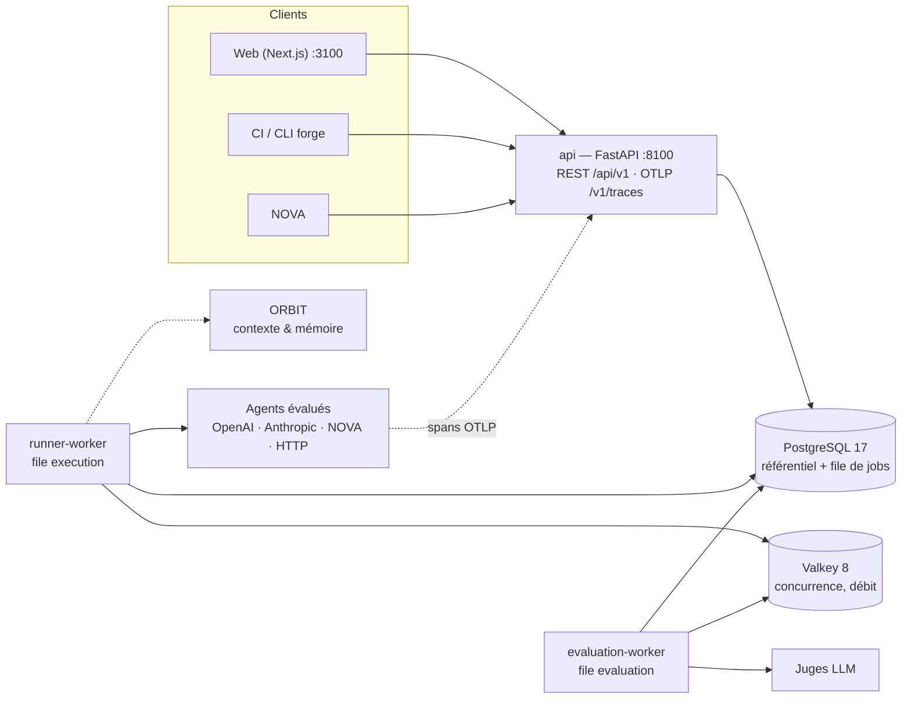

# FORGE — Laboratoire d'évaluation des agents IA

> **« Est-ce que cette nouvelle version de mon agent est réellement meilleure ? »**
> FORGE y répond de façon mesurable : sur quels scénarios, sur quels critères, à quel coût,
> avec quelles erreurs, quelles régressions et quel niveau de confiance.

FORGE fait partie de la constellation **NOVA** (création et orchestration des agents) ·
**ORBIT** (contexte, règles, connaissances, mémoire) · **FORGE** (évaluation, comparaison,
amélioration) · **LEAP** (formation aux usages de l'IA). Il évalue les agents NOVA, mais reste
générique : tout agent accessible par API peut être testé.

FORGE n'est pas un tableau de bord de supervision : c'est un **laboratoire**. L'entité centrale
est l'**Evaluation Run** = scénario (version) + agent (version) + configuration + trace
d'exécution + évaluations + scores, figés dans un manifeste reproductible.

## Ce que fait FORGE

1. **Scenario Manager** : scénarios versionnés (entrée, contexte, contraintes, résultat attendu,
   critères, règles déterministes, réponses d'outils simulées), variantes pour mesurer la
   robustesse, scénarios **publics**, **privés** (contenu masqué, test de généralisation) et
   **frais** (détection de sur-optimisation), import/export YAML, canaris anti-contamination.
2. **Agent Registry** : agents et versions immuables (modèle, prompt versionné, outils, contexte
   ORBIT, mémoire, orchestration), diff entre versions, test à la volée.
3. **Agent Runner** : adapters OpenAI, Anthropic, NOVA, API HTTP générique (FORGE Agent
   Protocol ou requête/réponse mappées), agent simulé ; boucle d'outils pilotée par FORGE,
   budgets, délais, limites de concurrence distribuées, propagation W3C `traceparent`.
4. **Trace Collector** : trace complète (messages, appels de modèles et d'outils, erreurs,
   tokens, coût, latence par étape) ; ingestion **OpenTelemetry (OTLP/HTTP)** avec les
   conventions GenAI ; timeline rejouable.
5. **Evaluation Engine** : règles déterministes (JSON, schéma, regex, sections, citations,
   sources, données personnelles, outils, coût, latence, canaris), **juges LLM** avec grille,
   justification, preuves liées à la trace et confiance, **multi-juges** (moyenne, médiane,
   vote, pondération, expression personnalisée — chaque verdict conservé), **évaluation
   humaine**.
6. **Scores explicables** : 8 dimensions (qualité, cohérence, raisonnement, sécurité, robustesse,
   coût, latence, expérience utilisateur), `ScoreConfiguration` versionnée (pondérations,
   normalisation, garde-fous), composite accompagné de sa formule. **Aucun score sans
   explication** : chaque note remonte au critère, au juge (modèle, version, prompt), à la règle
   et à l'étape de trace concernée.
7. **Taxonomie d'erreurs** extensible (hallucination, contradiction, mauvais outil, fuite de
   données, erreur de source, de mémoire…) avec gravité, preuve et évaluateur.
8. **Feedback structuré** (forces, faiblesses, erreurs, recommandations priorisées), lisible par
   un humain et exploitable par une machine (NOVA).
9. **Benchmarks** N scénarios × M agents × K répétitions, comparaisons par agent, modèle,
   version, scénario, famille, catégorie, type d'erreur, coût, latence.
10. **Expériences** baseline → candidate : deltas par critère avec intervalles de confiance,
    tests statistiques appariés, **régressions par scénario**, recommandation
    (déployer / avec prudence / ne pas déployer / non concluant), **garde-fou CI**.
11. **Calibration humaine** : gold datasets, accord IA/humain (kappa pondéré, corrélations,
    écart moyen), file de revue priorisée par le désaccord des juges.
12. **Auditabilité** : journal immuable, manifestes, hashes de contenu, provenance des scores.

## En ligne

* Interface : <https://forge-pied-rho.vercel.app> (Vercel)
* API : <https://api-production-b165a.up.railway.app/api/v1/docs> (Railway)
* Déploiement : [docs/DEPLOYMENT.md](docs/DEPLOYMENT.md)

## Démarrage rapide

Prérequis : Docker (Compose v2). Optionnel : clés OpenAI / Anthropic pour des juges LLM.

```bash
cp .env.example .env        # ajoutez FORGE_OPENAI_API_KEY / FORGE_ANTHROPIC_API_KEY si souhaité
make up                     # construit et démarre la plateforme
make seed                   # charge la démonstration (agents, scénarios, benchmark, expérience)
```

* Interface : <http://localhost:3100> — `admin@forge.local` / `forge-admin`
* API : <http://localhost:8100/api/v1/docs> · OTLP : `POST http://localhost:8100/v1/traces`
* Sans clé LLM, FORGE utilise un **juge heuristique hors ligne** clairement signalé ; configurez
  un juge LLM pour des évaluations de production.

## Architecture



| Service | Rôle | Port hôte |
|---|---|---|
| `web` | Interface Next.js 15 | 3100 |
| `api` | REST, OTLP, `/metrics`, `/health`, `/ready` | 8100 |
| `runner-worker` | Exécution des agents (scalable) | — |
| `evaluation-worker` | Règles, juges, scores, agrégations | — |
| `demo-agents` | Agents simulés de démonstration | 8190 |
| `postgres` | Source de vérité, file de jobs `SKIP LOCKED` | 5434 |
| `valkey` | Limites distribuées | 6381 |

Détails : [docs/ARCHITECTURE.md](docs/ARCHITECTURE.md) (contrat d'implémentation),
[docs/AGENT_PROTOCOL.md](docs/AGENT_PROTOCOL.md) (brancher un agent),
[docs/CI.md](docs/CI.md) (bloquer un déploiement sur régression),
[docs/DEMO.md](docs/DEMO.md) (scénario de démonstration),
[docs/OPERATIONS.md](docs/OPERATIONS.md) (production : secrets, TLS, sauvegardes, supervision, mises à jour).

## Stack

Python 3.12 · FastAPI · Pydantic v2 · SQLAlchemy 2 (async) · Alembic · PostgreSQL 17 ·
Valkey 8 · httpx · NumPy / SciPy · OpenTelemetry · Prometheus · Next.js 15 · React 19 ·
TypeScript · Tailwind CSS v4 · Radix UI · TanStack Query · Recharts. Tout est open source.

## Sécurité

* Rôles `viewer` ⊂ `evaluator` ⊂ `editor` ⊂ `maintainer` ⊂ `admin` ; clés d'API de service
  (`fgk_…`, hash seul stocké, scopes, expiration).
* Identifiants des fournisseurs chiffrés (Fernet, `FORGE_SECRETS_KEY`), jamais renvoyés par l'API,
  jamais écrits dans les manifestes.
* Scénarios privés : résultats visibles, contenu, résultat attendu, règles et justifications masqués ;
  les agents ne voient jamais le résultat attendu.
* Classification C0 → C3 alignée sur ORBIT ; un bandeau d'avertissement s'affiche pour les
  contenus **C2 (Confidentiel)** et **C3 (Secret)**.
* En production (`FORGE_ENV=production`), les secrets de développement sont refusés au démarrage.

## Développement

```bash
make infra          # postgres + valkey
make dev-backend    # API sur :8100 avec rechargement
make dev-worker     # worker (deux files)
make dev-frontend   # UI sur :3000
make check          # ruff, mypy, contrats d'architecture, tests, lint + typecheck frontend
```
